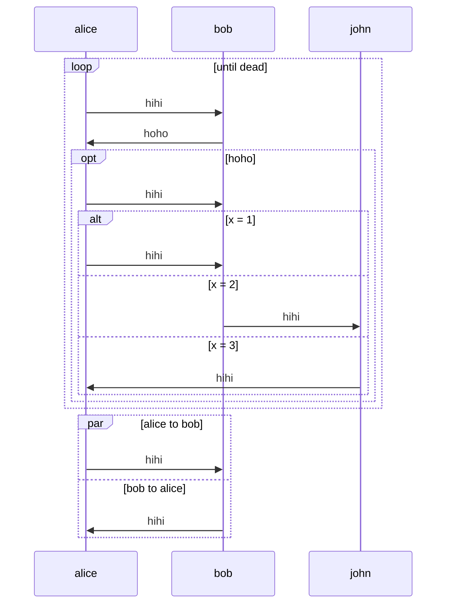
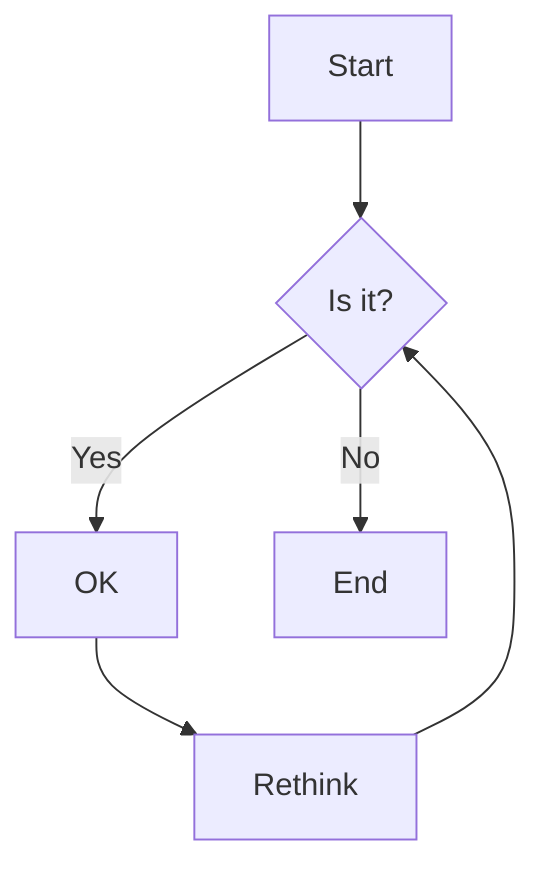

# mermaid-clj

This fork aims to:

- Completely rewrite the original as well as make syntax changes,
- Update the original to the current Sequence Diagram APIs, and
- Extend the domain to other diagrams, such as Flowcharts, Class Diagrams, and more.

## Usage

### Sequence Diagram

```clojure
(sequence-diagram
     (loop "until dead"
          (solid-arrow :alice :bob "hihi")
          (solid-arrow :bob :alice "hoho")
          (optional "hoho"
                (solid-arrow :alice :bob "hihi")
                (alternative
                     ["x = 1" [(solid-arrow :alice :bob "hihi")]]
                     ["x = 2" [(solid-arrow :bob :john "hihi")]]
                     ["x = 3" [(solid-arrow :john :alice "hihi")]])))
     (parallel
       ["alice to bob" [(solid-arrow :alice :bob "hihi")]]
       ["bob to alice" [(solid-arrow :bob :alice "hihi")]]))
```

The above DSL program translates to:



### Flowchart

```clojure
(let [A (node "Start")
      B (rhombus "Is it?")
      C (node "OK")
      D (node "Rethink")
      E (node "End")]

  (flow-chart :TD
    (arrow A B)
    (arrow B C :message "Yes")
    (arrow C D)
    (arrow D B)
    (arrow B E :message "No")))
```

The above DSL program translates to:

